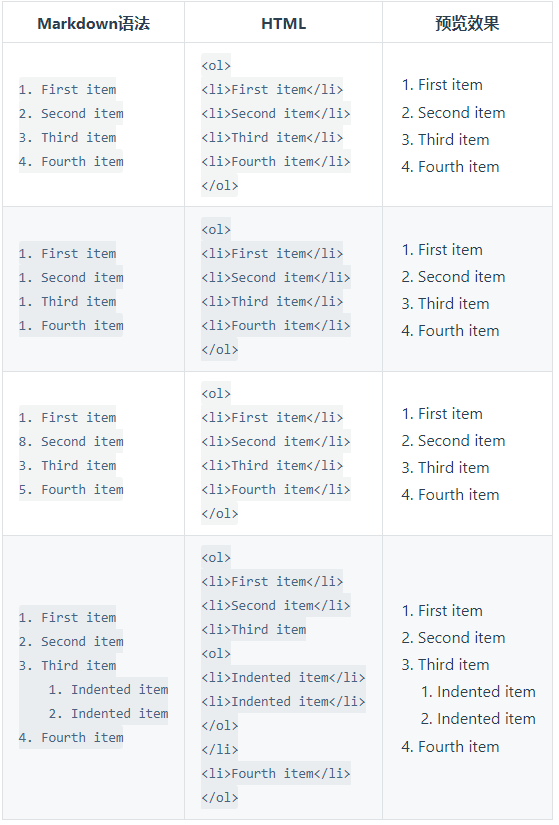

# 总结

```markdown
1、引用语法
> content
2、有序列表
 1. 数字加句号
3、无序列表
-   -加空格
4、代码
 ` content `
 ``` content ```
5、分割线
---

```


# Markdown 引用语法

### 要创建块引用，请在段落前添加一个 `>` 符号。

```markdown
> Dorothy followed her through many of the beautiful rooms in her castle.
```

### 渲染效果如下

>要创建块引用，请在段落前添加一个 `>` 符号。

## 多个块的引用

```markdown
> Dorothy followed her through many of the beautiful rooms in her castle.
>
> The Witch bade her clean the pots and kettles and sweep the floor and keep the fire fed with wood.
```

### 渲染效果如下：

>Dorothy followed her through many of the beautiful rooms in her castle.
>
>The Witch bade her clean the pots and kettles and sweep the floor and keep the fire fed with wood


## 多层嵌套引用

```markdown
> Dorothy followed her through many of the beautiful rooms in her castle.
>
>> The Witch bade her clean the pots and kettles and sweep the floor and keep the fire fed with wood.
```


### 渲染效果如下：

> Dorothy followed her through many of the beautiful rooms in her castle.
>
> > The Witch bade her clean the pots and kettles and sweep the floor and keep the fire fed with wood.


## 带有其它元素的块引用

### 块引用可以包含其他 Markdown 格式的元素。并非所有元素都可以使用，你需要进行实验以查看哪些元素有效。

```text
> #### The quarterly results look great!
>
> - Revenue was off the chart.
> - Profits were higher than ever.
>
>  *Everything* is going according to **plan**.
```

### 渲染效果如下：

> #### The quarterly results look great!
>
> - Revenue was off the chart.
> - Profits were higher than ever.
>
> *Everything* is going according to **plan**.


# Markdown 列表语法

## 有序列表

要创建有序列表，请在每个列表项前添加<font color='red'>数字并紧跟一个英文句点</font>。数字不必按数学顺序排列，但是列表应当以数字 1 起始。



## 无序列表

------

要创建无序列表，请在每个列表项前面添加破折号 (-)、星号 (*) 或加号 (+) 。缩进一个或多个列表项可创建嵌套列表。

### 语法

```markdown
- First item
- Second item
- Third item
- Fourth item
    - Fifth item
    - Sixth item
```

### 效果

> - First item
> - Second item
> - Third item
> - Fourth item 
>       - Fifth item
>       - Sixth item

### 在列表中嵌套其他元素

要在保留列表连续性的同时在列表中添加另一种元素，请将该元素缩进四个空格或一个制表符，如下例所示：

#### 段落

```markdown
-   This is the first list item.
-   Here's the second list item.

   >  I need to add another paragraph below the second list item.

-   And here's the third list item.
```

#### 渲染效果如下

> - This is the first list item.
>
> - Here's the second list item.
>
>     >  I need  to add another paragraph below the second list item. 
>
> - And here's the third list item .


# 代码块

## 单个代码单词

### 语法

```markdown
`wo`
```

### 效果

> `wo`

## 代码块

### 语法

```
```markdown代码块
```


### 效果

```markdown
代码块
```


#  Markdown 分隔线语法

要创建分隔线，请在单独一行上使用三个或多个星号 (`***`)、破折号 (`---`) 或下划线 (`___`) ，并且不能包含其他内容。

```text
***

---

_________________
```

以上三个分隔线的渲染效果看起来都一样：

------

### [#](https://markdown.com.cn/basic-syntax/horizontal-rules.html#分隔线（horizontal-rule）用法最佳实践)分隔线（Horizontal Rule）用法最佳实践

为了兼容性，请在分隔线的前后均添加空白行。

| ✅ Do this                                                    | ❌ Don't do this                                              |
| ------------------------------------------------------------ | ------------------------------------------------------------ |
| `Try to put a blank line before...---...and after a horizontal rule.` | `Without blank lines, this would be a heading.---Don't do this!` |
