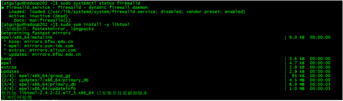
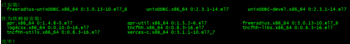
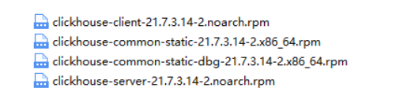
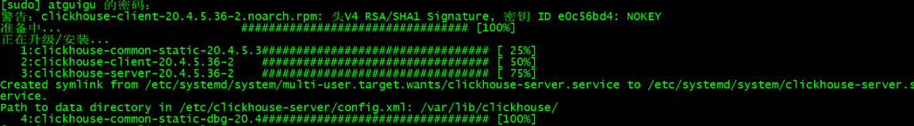
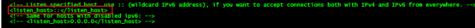
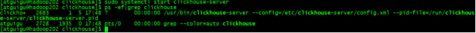
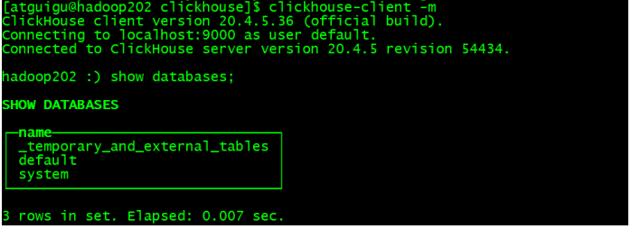

2.1 准备工作
2.1.1 确定防火墙处于关闭状态
2.1.2 CentOS 取消打开文件数限制
（1）在 hadoop102 的 /etc/security/limits.conf 文件的末尾加入以下内容
[atguigu@hadoop102 ~]$ sudo vim /etc/security/limits.conf

* soft nofile 65536

* hard nofile 65536

* soft nproc 131072

* hard nproc 131072
  （2）在 hadoop102 的/etc/security/limits.d/20-nproc.conf 文件的末尾加入以下内容
  [atguigu@hadoop102 ~]$ sudo vim /etc/security/limits.d/20-nproc.conf

* soft nofile 65536

* hard nofile 65536

* soft nproc 131072

* hard nproc 131072
  （3）执行同步操作

  ### 安装

  在 `hadoop1`、`hadoop2`、`hadoop3` 安装 rsync，执行下面命令：

  ```shell
  yum install -y rsync
  ```

  **注意：** 3台服务器都要安装

  同步工作

```shell
rsync -av /etc/security/limits.conf root@hadoop2:/etc/security/limits.conf
```

```java
rsync -av /etc/security/limits.conf root@hadoop3:/etc/security/limits.conf
```


```shell
rsync -av /etc/security/limits.d/20-nproc.conf root@hadoop2:/etc/security/limits.d/20-nproc.conf
```


```shell
rsync -av /etc/security/limits.d/20-nproc.conf root@hadoop3:/etc/security/limits.d/20-nproc.conf
```

2.1.3 安装依赖

```shell
 sudo yum install -y libtool
```



```shell
 sudo yum install -y unixODBC
```


在 hadoop103、hadoop104 上执行以上操作

2.1.4 CentOS 取消 SELINUX
（1）修改/etc/selinux/config 中的 SELINUX=disabled
[atguigu@hadoop102 ~]$ sudo vim /etc/selinux/config
SELINUX=disabled
注意：别改错了
（2）执行同步操作

```shell
rsync -av /etc/selinux/config root@hadoop2:/etc/selinux/config
```


```shell
rsync -av /etc/selinux/config root@hadoop3:/etc/selinux/config
```


（3）重启三台服务器


2.2 单机安装
官网：https://clickhouse.tech/
下载地址：http://repo.red-soft.biz/repos/clickhouse/stable/el7/
2.2.1 在 hadoop102 的/program/clickhouse 下创建 clickhouse 目录，并将rpm材料放进去

```shell
mkdir /program/clickhouse
```



2.2.2同步材料

```shell
rsync -av /program/clickhouse/* root@hadoop2:/program/clickhouse/
```


```shell
rsync -av /program/clickhouse/* root@hadoop3:/program/clickhouse/
```

2.2.3分别在三台机子上安装这 4 个 个 rpm 文件

```shell
cd /program/clickhouse
```


```shell
sudo rpm -ivh *.rpm
```

2.2.3查看安装情况


```shell
sudo rpm -qa|grep clickhouse
```


 


2.2.5 修改配置文件

（1)把 <listen_host>::</listen_host> 的注释打开，这样的话才能让 ClickHouse 被除本
机以外的服务器访问

```shell
sudo vim /etc/clickhouse-server/config.xml
```




（2）分发配置文件

```shell
//尚硅谷的方法，之前马老师的方法自己写 。。因为hadoop1磁盘满了，此处开始不再三个同时安装，只安装hadoop2.
sudo /home/atguigu/bin/xsync /etc/clickhouse-server/config.xml
```

2.2.6 启动 Server

```shell
sudo systemctl start clickhouse-server
```



2.2.7 三台机器上关闭开机自启

```shell
sudo systemctl disable clickhouse-server
```


2.2.8 使用 client 连接 server

```shell
clickhouse-client -m
```



> -m :可以在命令窗口输入多行命令


在这个文件中，有 ClickHouse 的一些默认路径配置，比较重要的
数据文件路径：<path>/var/lib/clickhouse/</path>
日志文件路径：<log>/var/log/clickhouse-server/clickhouse-server.log</log>

常用 命令：

```shell
sudo clickhouse start
clickhouse-client -m
```

