# 0 重点内容


## 0.1 parameter tool工具从程序启动参数中提取配置项

```java
// parameter tool工具从程序启动参数中提取配置项
ParameterTool parameterTool = ParameterTool.fromArgs(args);
String host = parameterTool.get("host");
int port = parameterTool.getInt("port");

//实际传值时
--host localhost --port 7777
```

## 0.2 8081 是flink的网页监控端口


## 0.3 socket文本流

```java
env.socketTextStream("localhost","7777");
```


打开socket端口，即可以输入（linux系统）

```shell
nc -lk 7777
```

## 0.4 sql 

over 


# 1、为什么选择Flink

- 低延迟
- 高吞吐
- 结果的准确性和良好的容错性

低延迟：指的是流处理，快速处理给出最新结果，不需要攒一批再给出结果。

高吞吐：指的是分布式处理大量数据。

结果的准确性和良好的容错性。

# 2、Flink vs Spark Streamimg

- 数目模型

  - spark采用RDD模型，spark streaming的DStream实际上就是一组组小批数据RDD的集合
  - flink基本数据模型是数据流以及事件（event）序列

- 运行时架构

  - spark是批计算，将DAG划分为不同的stage，一个完成后才可以计算下一个
  - flink是标准的流执行模式，一个事件在一个节点处理完后可以直接发往下一个节点进行处理

  

  

  

  # 3、快速上手

  ## 3.1pom文件引入

  ```xml
  
  //java包
  <artifactId>flink-java</artifactId>
  
  //2.12是scala版本
  //为什么会用到scala，因为此包中用到了akkaa，akkaa是用scala写的。
  <artifactId>flink-streaming-java_2.12</artifactId>
  
  
  ```

  

  

  ## 3.2dataset

  

  #### 3.2.1 简单批处理案例

  ```java
  // 创建执行环境
  ExecutionEnvironment env = ExecutionEnvironment.getExecutionEnvironment();
  // 从文件中读取
  String inputPath = "D:\\Projects\\..";
  DataSet<String> inputDataSet = env.readTextFile(inputPath);
  // 对数据进行处理，按空格分词展开，转换成（work,1）二元组进行统计
  DataSet<Tuple2<String,Integer>> resultSet  = inputDataSet.flatMap( new MyFlatMapper())
              .groupBy(0)  //按照第一个位置的word分组
              .sum(1)      //将第二个位置的数据求和
  ```

  

  ### 3.2.2简单流处理案例

  ```java
  //创建流处理执行环境
  StreamExecutionEnvironment env = StreamExecutionEnvironment.getExecutionEvnironment();
  
  //并行度。  开发环境下，默认是核数
  env.setParallelism(8);
  //从文件中读取数据
  String inputPath = "D://。。。";
  
  //基于数据流进行转换计算
  DatadSteam<String> inputDataStream = env.readTextFile(inputPath);
  
  // 基于数据流进行转换计算
  DataStream resultStream = inputDataStream.flatMap( new MyFlatMapper())
                 .keyBy(0)
                 .sum(1)
  
  resultStram.print();
  
  //执行任务
  env.execute();
      
  ```

  


# 3、Flink 部署

## 3.1 Standalone 独立集群模式

是有hadoop版本依赖支持。

在lib中要有hadoop依赖，官网中Addtionnal Components组建中下载，放到flink的lib中去。（之前版本是直接包含的，最新的需要下载）

bin中的常用命令：

```
start-cluster.sh
stop-cluster.sh

jobmanager.sh   //整个活动的管理者
taskmanager.sh  //某个任务的管理者

yarn-session.sh   //yarn部署的命令

flink //最重要的命令
```


conf

> flink-conf
>
> - jobmanager.rpc.address: localhost    jobmanager的地址 
>
> - jobmanager.heap.size: 1024m    //配置堆大小
>
> - taskmanager.memory.process.size: 1728m   //taskmanager总内存
>
> - taskmanager.numberOfTaskSlots: 1(设置最大的状态)
>
> - parallelism.default: 1（动态的能力）
>
>   


> 修改/conf/slaves文件
>
> hadoop2
>
> hadoop3

 将配置发送到其他两台机器。


**并行度优先级：**

代码>运行时配置>文件配置


8081 web ui提交


## 3.2 yarn 模式

前提：得要放hadoop依赖

分为Session-Cluster 和 Per-Job-Cluster

### 3.2.1 Session-Cluster 模式

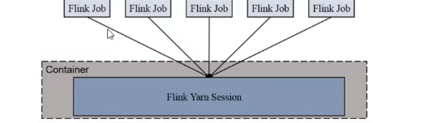

Session-Cluster模式需要先启动集群，然后再提交作业，接着会向yarn申请一块空间后，资源永远保持不变。如果资源满了，下一个作业就无法提交，智能等到yarn中的其中一个作业执行完成后，释放了资源，下个作业才会正常提交。所有作业共享Dispatcher和ResourceMangager；共享资源；适合规模小执行时间短的作业。

在yarn中初始化一个flink集群，开辟制定的资源，以后提交任务都向这里提交。这个flink集群会常驻在yarn集群中，除非手工停止。

### 3.3.2 Per-Job-Cluster 模式：

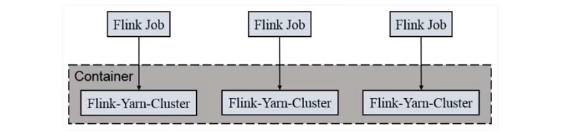

一个Job会对应一个集群，没提交一个作业会根据自身的情况，都会单独向yarn社情资源，指导作业执行完成，一个作业的失败与否并不会影响下一个作业的正常提交和运行。独享Dispathcer和ResourceManager，按需接受资源申请；适合规模大长时间运行的作业。

每次提交都会常见一个新的flink集群，任务之间相互独立，互不影响，方便管理。任务执行完成之后创建的集群也会消失。


启动yarn-session

```shell
./yarn-session.sh -n 2 -s 2 -jm 1024 -tm 1024 -nm test -d
```


> 其中：
>
> -n (--container): TaskManager的数量，最新版本已经取消，可以通过yarn自动分配
>
> -s(--slots): 每个TaskMagager的slot数量，默认一个slot一个core,默认每个taskmanager的slot的个数为1，有时可以多一些taskmanager，做冗余。
>
> -jm :jobManager的内存（单位MB）
>
> -tm:每个taskmanager的内存(单位MB)
>
> -nm: yarn的appName(yarn的ui上的名字)
>
> -d：后台运行

取消yarn-session

```shell
yarn appolication --kill  applicaiton_1577588252906_001
```


Per Job Cluster模式

- 启动hadoop集群（略）

- 不启动yarn-session，直接执行job

  ```shell
  ./flink run -m yarn-cluster -c com.atguigu.wc.StreamWordCount FlinkTutorial-1.0-SNAPSHOT-jar-with-dependencies.jar --host localhost -port 7777
  ```

  

# 4、运行时架构 


## 4.1Flink运行时组件

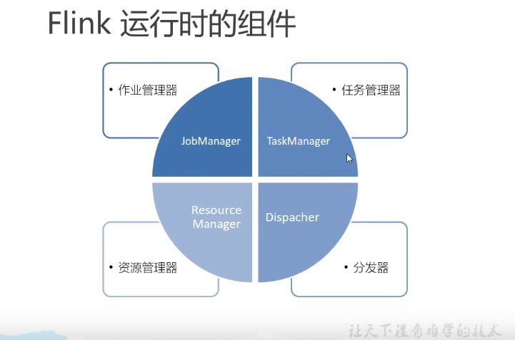

### 4.1.1 JobMangager  作业管理器

- 控制一个应用程序执行的主进程，也就是说，每个应用程序都会被一个不同的JobManager所控制执行。
- JobMananager 形成工作流程图；申请资源（TaskManager）上的插槽(slot)；
- 检查点checkpoint的协调

### 4.1.2 TaskManager  工作进程

- 包含多个slot

### 4.1.3 ResourceManager 资源管理器

- 主要负责管理任务管理器（TaskManager）的插槽（slot）,TaskManager的插槽是Flink中定义的处理资源单元


### 4.1.3分发器（Dispatcher）

- 程序的对外接口


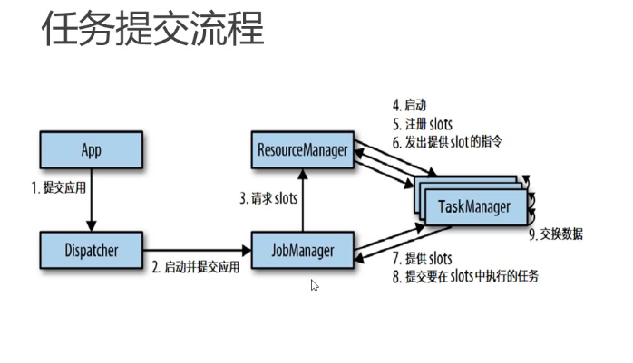


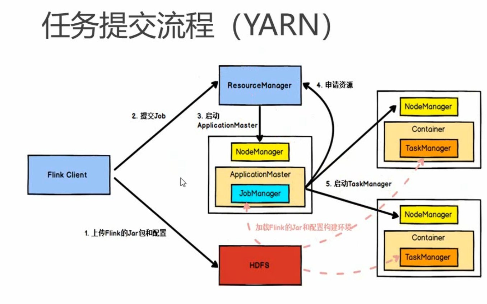


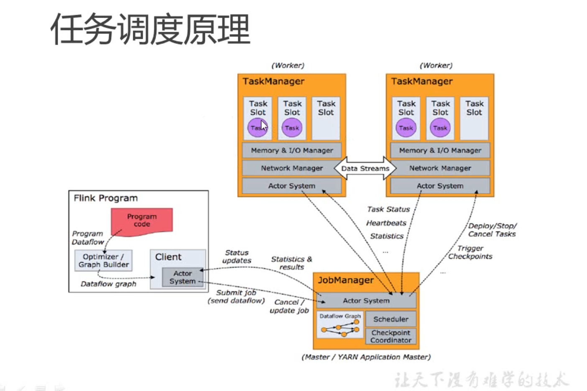

## 4.2 slot和运行调度

### 4.2.1并行度（Parallelism）

> 一个特定算子的子任务（subtask）的个数被称之为并行度(parallelism)，一般情况下，一个stream的并行度，可以认为就是其所有算子中最大的并行度

## 4.2.2slot

slot 就是独立的计算资源。

slot个数一般设置为当前机器的核心数量，是JVM的线程。

TaskManager就是一个JVM进程，一台机器。


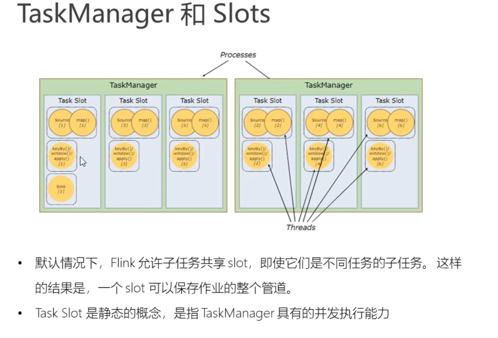

### 4.2.2 .1slotSharingGroup

slot可以设置共享组。共享组的slot可以共享。不同共享组的一定不会共享slot。程序默认所有子任务都是default组。

```
slotSharingGroup("red")
```


### 4.2.2.2slot并行度配置

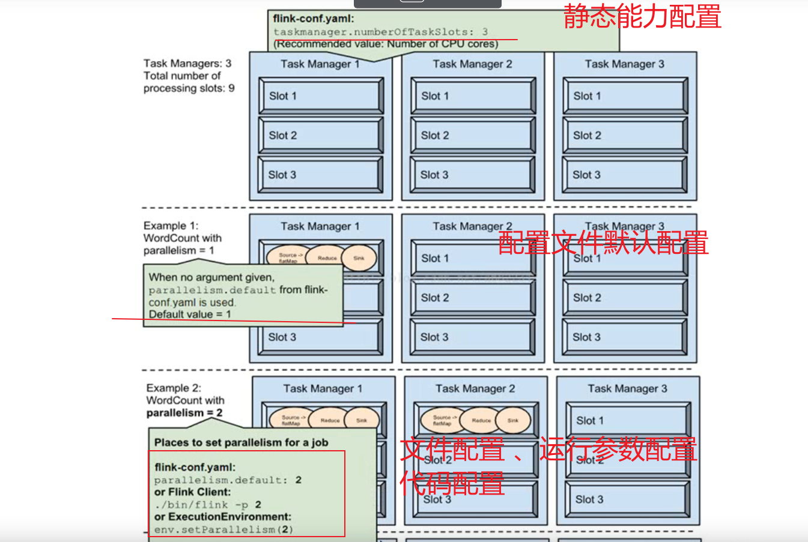

## 4.2.3 程序与数据流（DataFlow）

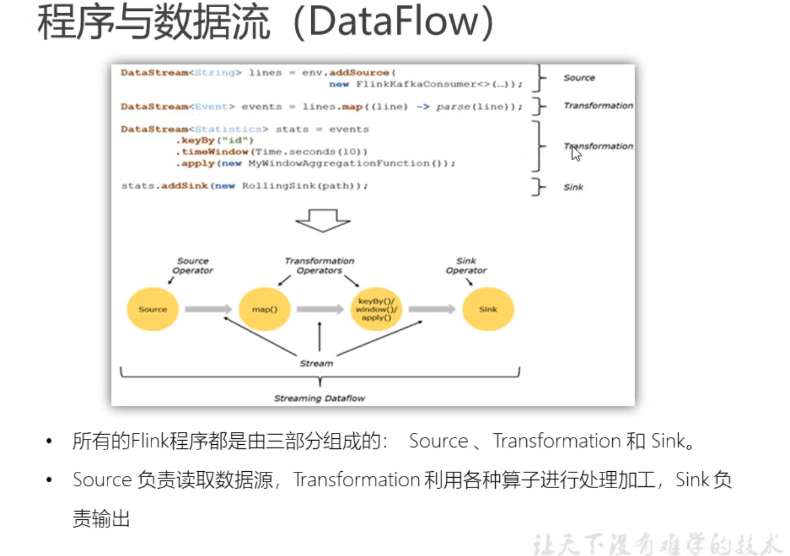

- 所有的Flink程序都是由三部分组成的：Source、Transformation 和 Sink
- Source负责读取数据源,Transformation利用各种算子进行处理加工，Sink负责输出

## 4.2.4执行图

- Flink 中的执行图可以分成四层： StreamGraph ->JobGraph ->ExecutionGraph ->物理执行图


> 小知识：keyby不是做计算，而是hash重分区

## 4.2.5数据传输形式

算子之间传输模式

one-to-one

Redistributing

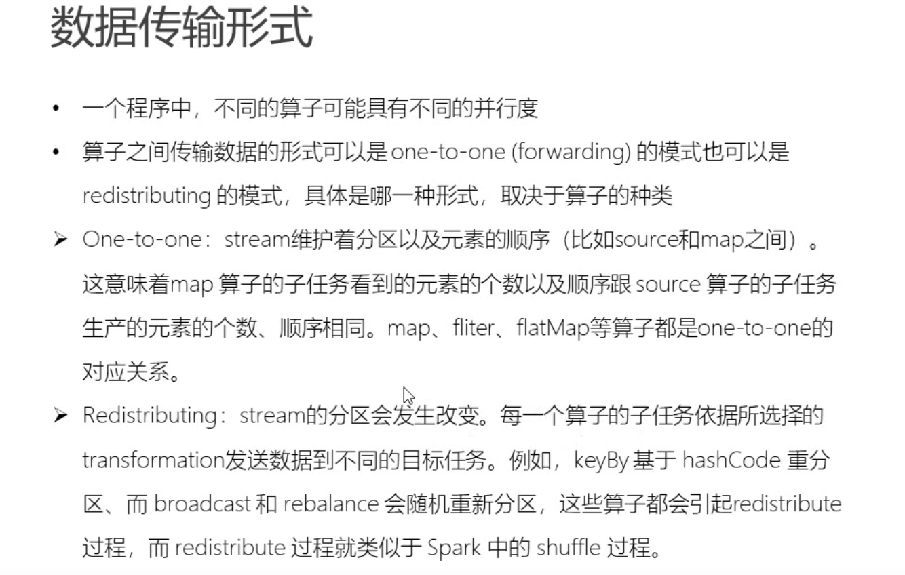


**任务合并的条件**

任务链的合并。

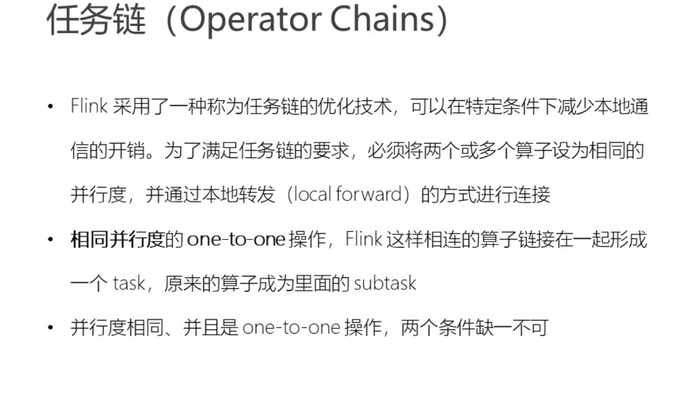

断开任务链的两种方法：

```java
.shuffle();  //重新分区
    
.disableChaining();  //前后断开

.startNewChain();  //前面断开
```


# 5、DataStream API


## 5.1 Environment


功能是环境的封装，帮我们判断是开发环境还是flink集群环境。

```java
// 批处理环境获取
ExecutionEnvironment env = ExecutionEnvironment.getExecutionEnvironment();
// 流处理环境获取
StreamExecutionEnviroment env = StreamExecutionEnvironment.getExecutionEnvironment();
// 设置并行度
env.setParallelism();

//指定执行环境
//返回本地执行环境，需要 在调用的时候指定默认的并行度
LocalStreamEnvironment env = StreamExecutionEnvironment.createLocalEnvironment(1);

//指定集群执行环境，将jar提交到远程服务器上。需要在调用时指定JobManager的IP和端口号，并指定要在集群中运行的jar包
StramExecutionEnvironment env = StreamExecutionEnvironment.createRemoteEnvironment("jobmanage-hostname",6123,"YOURPATH//WorkCount.jar");
```


## 5.2 Source

### 5.2.1从集合读取数据

```java
//flinK包装用的数据
public class SensorReading{
    // 属性：id ,timestamp ,temperature
    //需要空的构造器  getter setter
}
```


```java
//从集合读取数据
env.fromCollection()
    
//从元素获取数据
env.fromElements()
    
//执行任务
env.excute();
   
```


### 5.2.2 从文件读取

```java
env.readTextFile("D:\...");
```


### 5.2.3从kafka读取数据

pom引入连接器

里面涉及到kafka版本  scala版本 flink版本

```xml
<dependency>
    <groupId>org.apache.flink</groupId>
    <artifactId>flink-connector-kafka-0.11_2.12</artifactId>
    <version>1.10.1</version>
</dependency>
```

//引入kafka

```javajava
Properties.. kafka的相关配置，查询官网即可

env.addSource(FinkKafkaConsumer类);
```

### 5.2.4 自定义数据


```java
env.addSource(new MySensorSource());


//自定义Source类
public static class MySensorSource implements SourceFunction{
    //定义标志位
    private boolean running =true;
    //重写run 
    void run(){
        while(running){
            ctx.collect();
        }
    }
    
    //重写cancel
    void cancel(){
        running = false;
    }
}

```


## 5.3Transform

### 5.3.1简单转换算子 map/flatMap/Filter


Filter使用功能:
//筛选

```java
//filter，筛选sersor_1开头的id对应的数据
DataStream<String> filterStream = inputStream.filter(
new FilterFunction({
      @Override
      public boolean filter(String value) throws Exception{
          //true，留下来
          //false,过滤掉
          return false;
      }
})
)

```


``` java
//控制台打印的流的名字叫做map
manSteam.print("map")；
```

### 5.3.2  keyBy    

broadcast（）广播，将内容广播出去。

shuffle() 随机发牌，将内容随机发送到下游。

rebalance() 轮询

rescale()    先分组再rebalance ..具体看尚硅谷 36课

global()    全部传给第一个

partitionCustom  自定义重分区方法

聚合操作之前需要keyBy操作

> DataStream ->KeyedStream:逻辑地将一个流拆分成不相交的分区。


```java
//当原数据流输入是对象时，需要根据id进行分区时，如下两个操作均可以。
keyBy("id")
keyBy(data -> getId());
```


### 5.3.3 滚动聚合算子

sum()

min()

max()   //计算只更新对象中的比较值

minBy()

maxBy()   //计算得出最新的对象

### 5.3.4 reduce聚合

//   value1是上次的计算结构

// value2是本次最新的流数据

``` java
T reduce(T value1,T value2) throws Exception;
```

KeyedStream ->DataStream的变化：

一个分组数据流的聚合操作。


### 5.3.5连接两条流操作 Connect    CoMap

分两步： Connect合并流，但是合并和数据格式仍然不一样


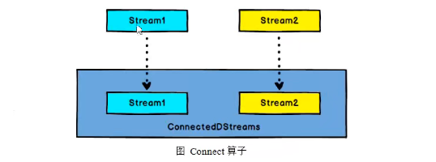


第二步:

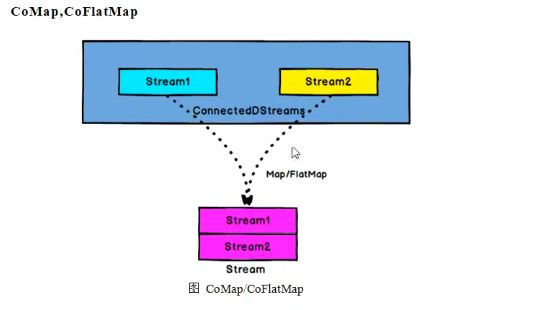

### 5.3.6 Union合流


union可以合并多条流，前提条件多条流的数据格式是一致的。

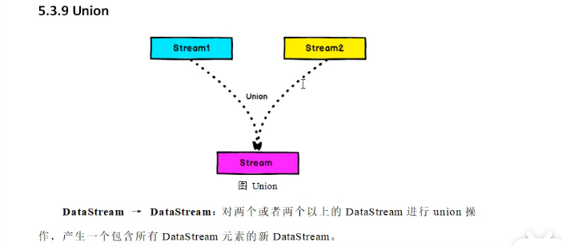


### 5.3.7 分流  Split  和  Select

按照一定的特征标记特定的流

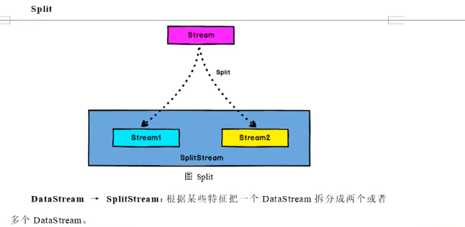

## 5.4 Flink支持的类型

基础数据类型

元组   Tuples

java POJOs简单对象 getter  setter和空构造器

Arrays,Lists,Maps,Enums

## 5.5函数类（Function Classes）

Flink暴露了所有udf函数的接口（实现方式为接口或者抽象类）。例如MapFunction,FilterFunction,ProcessFunction等等。


### 5.5.1 富函数  （Rich Function）

“富函数”是DataStream API 接口提供的一个函数类的接口，所有Flink函数类都有其Rich版本。它与常规函数的不同在于，可以获取运行环境的上下文，并拥有一些生命周期方法，所有可以实现更复杂的功能。

- RichMapFunction
- RichFlatMapFunction
- RichFilterFunction
- ...

Rich Function有一个生命周期的概念。典型的生命周期方法有：

- open() 方法时rich function 的初始化方法，当一个算子例如map或者filter被调用之前open()会被调用
- close（）方法时生命周期中最后调用的方法，做一些清理工作
- getRuntimeContext()  方法提供了函数的RuntimeContext的一些信息，例如函数执行的并行度，任务的名字，以及state的状态


## 5.6 Sink

addSink()

Connectors

Kafka

elastisch

redis

### **自定义JDBC** (40课）

```java
.sink(MySinkFunciton);
public static class MyJdbcSink extends RichSinkRunction<SensorReading>{
 Connection connection = null;
 PrepareStatement insertStmt = null;
 PreparedStatement updateStmt = null;
    @Override
    public void open(Configuration parameters) throws Exception{
    Connection connection = DriverManager.getConnection("jdbc://mysql://localhost:3306/test","root","root");
        insertStmt = connection.prepareStatement("insert into sensor_temp (id,temp) values (?,?) ");
        updateStmt = connection.prepareStatement("update sensor_temp set temp = ? where id = ?");
}
    
    @Override
    public void invoke(SensorReading value,Context context) throws Exception{
        updateStmt.setDouble(1,value.getTemperature());
        updateStmt.setString(2,value.getId);
        updateStmt.execute();
        //获取更新数量，如果更新数量为0，则添加1个  
        if(updateStmt.getUpdateCount()==0){
            insertStmt.setString(1);
        }
    }
    
    @Override
    public void close() throws Exception{
        insertStmt.close();
        updateStmt.close();
        connection.close();
    }
}
```


# 6、window API

窗口（window）

- 可以把无线的数据流进行切分，得到优先的数据集进行处理 ——也就是得到有界流
- 窗口(window)就是将无限流切割为有限流的一种方式，它会将流数据分发到有限大小的桶(bucket)中进行分析

**window类型**

- 时间窗口（Time Window）

  1 滚动时间窗口

  2 滑动时间窗口

  3 回话窗口

- 计数窗口（Count Window）

  1 滚动技数窗口

  2 滑动计数窗口

**滚动窗口（Tumbling Windows）**

- 将数据依据固定的窗口长度对数据进行切分
- 时间对齐，窗口长度固定，没有重叠

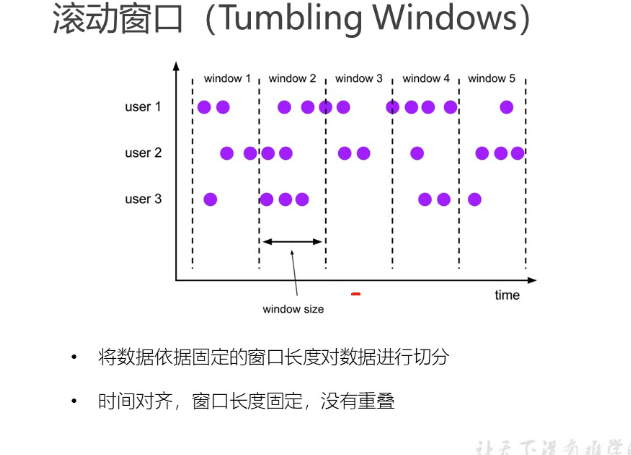

**滑动窗口（Sliding Windows)**

- 滑动窗口是固定窗口的更广义的一种形式，滑动窗口由固定的窗口长度和滑动间隔组成
- 窗口长度固定，可以有重叠

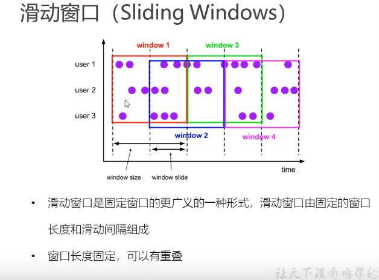

**会话窗口（Session Windows）**

- 由一系列时间组合一个指定时间长度的Timeout间隙组成，也就是一段时间没有接收到新数据就会生成新的窗口
- 特点：时间无对齐

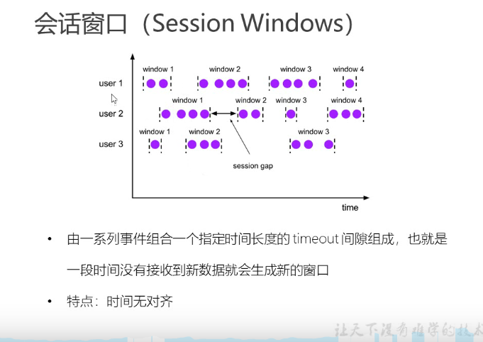

## 6.1Window Api

### 6.1.1窗口分配器——window()方法

​        1 我们可以利用.window()来定义一个窗口，然后基于这个window去做一些聚合或者其他处理操作。注意window()方法必须在**keyBy**之后才能用。

​         2 Flink提供了更加简单的.timeWindow和.countWindow方法，用于定义时间窗口和计数窗口。

```java
DataStream<Turple2<String,Double>> minTempPerWindowStream = dataStream
    .map(new MyMapper())
    .keyBy(data -> data.f0)
    .timeWindow(Time.seconds(15))
    .minBy(1);
```


> 小知识：windowAll相当于将并行度设置为1,类似于global

### 6.1.2 窗口函数（window function）

- window function 定义了要对窗口中收集的数据做的计算操作

- 可以分为两类：

   1 增量聚合函数

     - 每条数据到来就进行计算，保持一个简单的状态
     - ReduceFuction, AggregateFunction

- 全窗口函数(full window functions)

   1 先把窗口所有数据收集起来，等到计算的时候会遍历所有数据
  2 ProcessWindowFunction , WindowFunction

  ```java
  dataStream.keyby(...)
            .timeWindow(...)
            .apply(WindowFunction) //此处为全窗口函数或者是增量聚合函数的地方
  ```

  

> 其他可选API
>
> - trigger() ——触发器
>
>    定义window什么时候关闭，处罚计算并输出结果
>
> - evictor()——移除器
>
>   定义移除某些数据的逻辑
>
> - allowedLateness(Time.minutes(1)) ——允许处理迟到的数据
>
> - sideOutputLateData() ——将迟到的数据放入侧输出流
>
> - getSideOutput——获取侧输出流

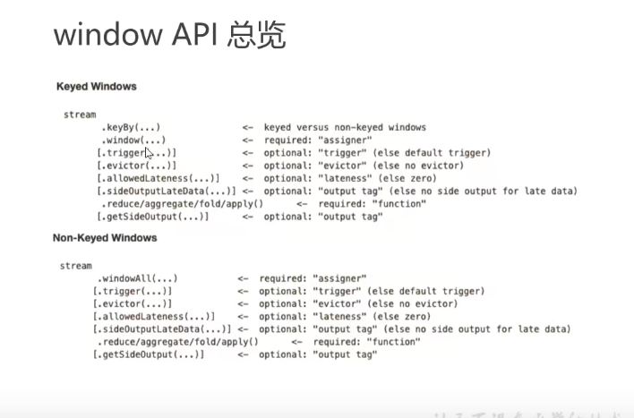


### 6.1.3迟到数据处理   47课


### 6.1.4 时间语义和watermark


# 9、Table Api 和  Flink SQL


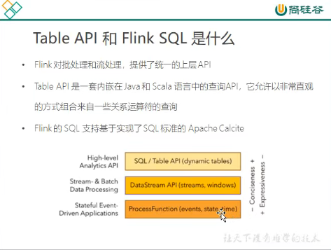

## 9.1 table api  和sql

pom文件

```xml
<!-- 最重要的，包含下面的包，是将任务解析成dataStream的组件 -->
<dependency>
    <groupId>org.apache.flink</groupId>
    <artifactId>flink-table-planner_2.12</artifactId>
    <version>1.10.1</version>
</dependency>

<!-- blink 版本,新版本   flink1.11后用此版本-->
<!-- 最重要的，包含下面的包，是将任务解析成dataStream的组件 -->
<dependency>
    <groupId>org.apache.flink</groupId>
    <artifactId>flink-table-planner-blink_2.12</artifactId>
    <version>1.10.1</version>
</dependency>


<!-- 可以不用引入 -->
<dependency>
    <groupId>org.apache.flink</groupId>
    <artifactId>flink-table-api-java-bridge_2.12</artifactId>
    <version>1.10.1</version>
</dependency>
```


```java
//创建表环境
StreamTableEnvironment tableEnv = StreamTableEnvironment.create(env);

//基于流创建一张表
Table dataTable = tableEnv.fromDataStream(dataStream);

//调用table Api
Table resultTable =dataTable.select("id,teperature")
         .where("id = 'sensor_1'");

//6table api
tableEnv.createTemporaryView("sensor",dataTable);

//  直接执行SQL
String sql = "select id,temperature from sensor where id = 'sensor_1'";
Table resultSqlTable = tableEnv.sql.sqlQuery(sql);


//   运行得到结果
tableEnv.toAppendStream(resultTable,Row.class).print("result");
tableEnv.toAppendStream(resultSqlTable,Row.class).print("sql");

env.excute();
```


## 9.2   基本程序结构

> Table API和SQL的程序结构，与流式处理的程序结构十分类似
>
> StreamTableEnvironment tableEnv = ...     //创建表的执行环境
>
> //创建一张表，用于读取数据
>
> TableEnv.connect(...).createTemporaryTable("inputTable");
>
> //注册一张表，用于把计算结果输出
>
> TableEnv.connect(...).createTemporaryTable("outputTable");
>
> // 通过Table API 查询算子，得到一张结果表
>
> Table result = tableEnv.sqlQuery("SELECT ... FROM inputTable ...");
>
> //将结果表写入输出表中
>
> result.insertInto("outputTable");

## 9.3 环境设置

环境配置，新版本和老版本明显不一样  82课


以下是基于blink的版本的api，如果是基于老版本的话，需要看一下尚硅谷82课。

```java
//基于Blink的流处理
EnvironmentSettings blinkStreamSettings = EnvironmentSettings.newInstance()
                   .useBlinkPlanner()
                   .inStreamingMode()
                   .build();
//基于Blink的批处理
EnvironmentSettings blinkBatchSettings = EnvironmentSettings.newInstance()
    .useBlinkPlanner()
    .inBatchMode()
    .build();
StreamTableEnvironment.create(env,oldStreamSettings);
```


## 9.4表

> TableEnvironment可以注册目录Catalog，并可以基于Catalog注册表
> 表（Table）是由一个“标识符”(identifier)来指定的，由3部分组成：Catalog名、数据库database名和对象名
>
> 表可以是常规的，也可以是虚拟的（视图，View）
>
> 常规表（Table）一般可以用来描述外部数据，比如文件、数据库表或消息队列的数据，也可以直接从DataStream转换而来
>
> 视图(View)可以从现有的表中创建，通常是tableAPI或者SQL查询的一个结果集

### **9.4.1创建表**

```java
tableEnv
    .connect(...)  //定义表的数据来源，和外部系统建立连接
    .withFormat(...)  //定义数据格式化方法
    .withSchema(...)  //定义表结构
    .createTemporaryTable("MyTable"); //创建临时表
```


案例：

```java
//表的创建 
//1、读取文件
String filePath = "D://";
table.connect(new FileSystem().path(filePath))
     .withFormat(new Csv())
     .withSchema(new Schema()
                 .field("id",DataTypes.STRING())
                 .field("timestamp",DataTYpes.BIGINT())
                 .fiels("temp",DataTypes.DOUBLE()))
    .createTemporaryTable("inputTable");
Table inputTable = tableEnv.from("inputTable");
tableEnv.toAppendStream(inputTable,Row.class).print();

env.execute();
```


pom文件

```xml
<dependency>
    <groupId>org.apache.flink</groupId>
    <artifactId>flink-csv</artifactId>
    <version>1.10.1</version>
</dependency>
```


### 9.4.2 表查询

  简单转换

```java
//SQL 
tableEnv.sqlQuery("select id,teperature from inputTable where id = 'sensor_6'");
Table sqlAggTable = tableEnv.sqlQuery("select id,count(id) as cnt,avg(temperature) as avgTemp from inputTable group by id");

//打印输出
table.toRetractStream(aggTable,Row.class).print("agg");
//注意：toRetractStream 而不是toAppendStream
```


### 9.4.3 输出表到文件


```java
//输出到文件
//第一步：注册一个外部表，同创建表
//第二步：
resultTable.insertInto("outputTable");
env.execute();
```


### 9.4.4 连接kafka


```java
//连接kafka，读取数据
tableEnv.connect(new Kafka()
                .version("0.11")
                .topic("snesor")
                 
                .property("zookeeper.connect","localhost:2181")
                .property("vbootstrap.servers","localhost:9092"))

```


### 9.4.5  更新模式

- 对于流式查询，需要声明如何在表和外部连接器之间执行转换
- 与外部系统交换的信息类型，由更新模式（Updata Mode）指定

1 追加（Append）模式

- 表只做插入操作 ，和外部连接器只交换插入(insert)消息

2 撤回（Retract）模式

- 表和外部连接器交换添加（Add）和撤回（Retract）消息
- 插入操作（Insert）编码为Add消息：删除（Delete）编码为Retract消息；更新（Update）编码为上一条的Retract和吓一跳的Add消息

3 更新插入（Upsert）模式

- 更新和插入都被编码为Upsert消息；删除编码为Delete消息

### 9.4.6输出到ES 

- 可以创建Table来描述ES中的数据，作为输出的TableSink

  ```java
  tableEnv.connect(
  new Elasticserarch()
  .version("6")
  .host("localhost",9200,"http")
  .index("sensor")
  .documentType("temp")
  )
      .inUpsertMode()
      .withFormat(new Json())
      .withSchema(new Schema()
                 .field("id",DataTypes.STRING())
                 .field("count"),DataTypes.BIGINT())
     )
      .createTemporaryTable("esOutputTable");
  aggResutTable.insertInto("esOutputTable");
  ```

  

### 9.4.7输出到Mysql

Flink专门为Table API的jdbc连接提供了flink-jdbc连接器，我们需要先引入依赖：

```xml
<dependency>
    <groupId>org.apache.flink</groupId>
    <artifactId>flink-jdbc_2.12</artifactId>
    <version>1.10.1</version>
</dependency>
```


```java
String sinkDDL="crewate talbe jdbcOutputTable ("+"id varchar(20) not null,"+"cnt_bigint not null"+") with ("+
"'connector.type'-'jdbc',"+
"'connector.url'='jdbc:mysql://localhost:3306/tetst',"+
"'connector.table'='sensor_count',"+
"'connector.driver'='com.mysql.jdbc.Driver',"+
"'connector.username'='root',"+
"'connector.passowrd'='123456'";
tableEnv.sqlUpdata(sinkDDL);  /执行DDL创建表
```


### 9.4.8将Table转换成DataStream

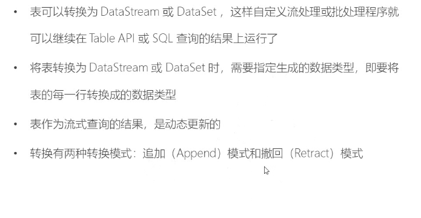

- 追加模式（Append Mode）

  用于表指挥被插入（Insert）操作更改的场景

  ```java
  DataStream<Row> resultStream = tableEnv.toAppendStream(resultTable.Row.class);
  ```


- 撤回模式（Retract Mode）

   1 用于任何场景。有些类似于更新模式中的Retract模式，它只有insert和Delete两类操作。

  2 得到的数据会增加一个Boolean类型的标识位（返回的第一个字段）,用它来表示到底是新增的数（Insert），还是被删除的数据（Delete）

  DataStream<Tuple2<Boolean,Row>> aggResultStream = tableEnv.toRetractStream(aggResutTable,Row.class);

### 9.4.9 将DataStream转换成表

- 对于一个DataStream,可以直接转换成Table，进而方便地调用TableApi做转换操作

  ```java
  DataStream<SensorReading> dataStream = ...
  Table sensorTable = table.Env.fromDataSteam(dataStream);
  ```

  

  

- 默认转换后的Table schema和DataSteam中的字段定义一一对应，也可以单独指定出来

  

```java
DataStream<SensorReading> dataStream = ...
Table sensorTable = tableEnv.fromDataStream(dataStream,"id,timestamp as ts,temperature");
```


> 小知识

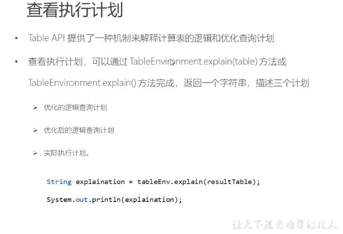


### 9.4.10 流处理和SQL的区别


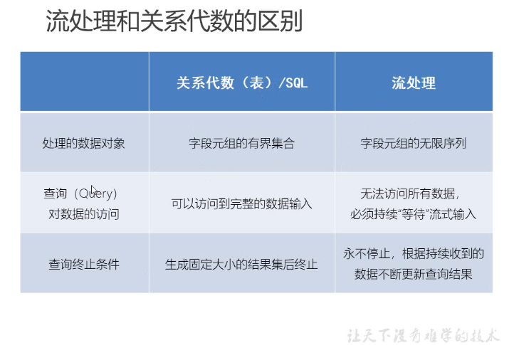


动态表（Dynamic Tables）


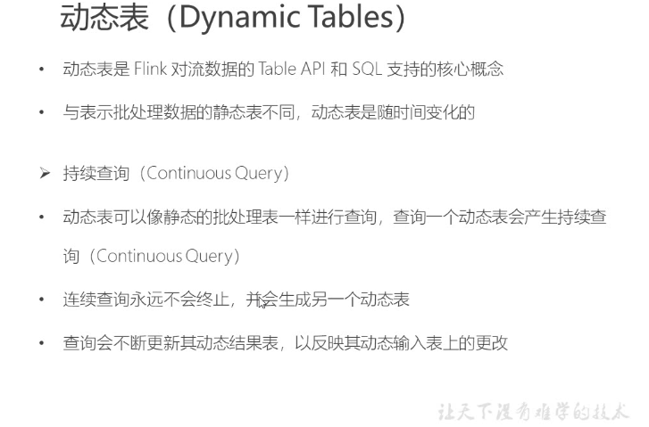


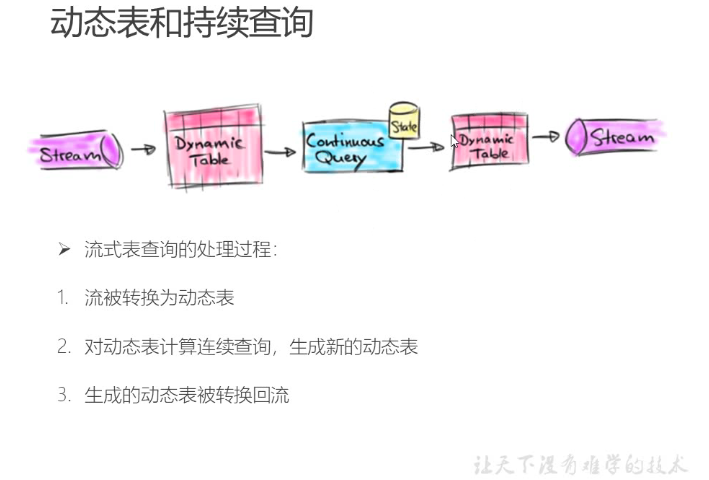


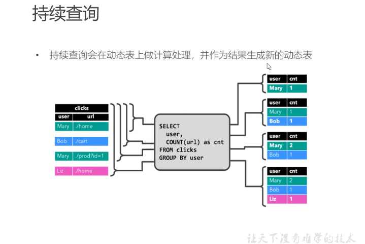


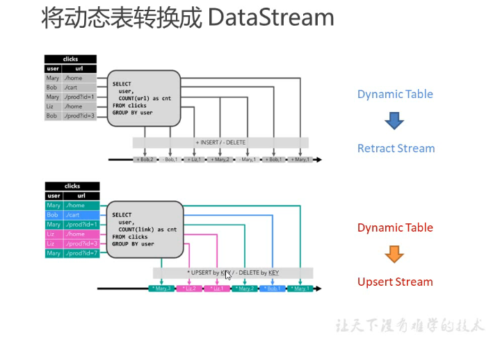

### 9.4.11 时间特性（Time Attributes）

- 基于时间的操作（比如Table API 和ＳＱＬ中窗口操作），需要定义相关的时间语义和时间数据来源信息
- Table可以提供一个逻辑上的时间字段，用于在表处理程序中，指示时间和访问相应的时间戳
- 时间属性，可以是每个表schema的一部分。一旦定义了时间属性，它就可以作为一个字段引用，并且可以在基于时间的操作中使用
- 时间属性的行为类似于常会时间戳，可以访问，并且进行计算


**定义处理时间(Processing Time)**

- 处理时间语义下，允许表处理程序根据机器的本地时间爱你生成结果。他是时间的最简单概念。它既不需要提取时间戳，也不需要生成watermark

- 由DataStream转换成表时指定

- 在定义Schema期间，可以使用.proctime，指定字段名定义处理时间字段

- 这个proctime属性只能通过附加逻辑字段，来拓展物理schema。因此，智能在shcma定义的末尾定义它

  流转换为table
  
  ```java
  Table sensorTable = tableEnv.fromDataStream(dataStream,"id,temperature,timestamp,pt.proctime");
  ```

  直接新建table


目前以下有可能报错

```java
.withSchema(
 new Schema()
    .field("id",DataTypes.STRING())
    .field("timestamp",DataTypes.BIGINT())
    .field("temperature",DataTypes.DOUBLE())
    .field("pt",DataTypes.TIMESTAMP(3))
    .proctime()
)
```


table sql  （仅仅 blink版本支持）

> pt AS PROCTIME() 如下例

```java
String sinkDDL = 
    "create table dataTable("+
    "id varhcar(20) not null,"+
    "ts bigint,"+
    "temperature double,"+
    "pt AS PROCTIME()"+
    ") with ("+
    "'connector.type'='filesystem',"+
    "'connector.path'= '/sensor.txt'"+
    "'format.type'='csv'";

tableEnv.sqlUpdata(sinkDDL);
```


### 9.4.12 定义事件时间（Event Time）

- 事件时间语义，允许表处理程序根据每个记录中包含的时间生成结果。这样即使在有乱序事件或者延迟事件时，也可以获得正确的结果。

- 为了处理无序事件，并区分流中的准时和迟到事件；Flink需要从事件数据中，提取事件戳，并用来推进事件时间的进展。

- 定义事件时间，同样有三种方法：

  1 由DataStream 转换成表时指定

  2 定义Table Schema 时指定

  3 在创建表的DDL中定义


```java
// 如果是设置成事件时间语义，需要在环境处设置
env.setStresamTimeCharacteristic(TimeCharacteristic.EventTime);
```


**方式一：由DataStream转换成表时指定**


> 在DataStream转换成Table，使用.rowtime可以定义时间事件属性

```java
//将DataStream转换成Table,并指定时间字段
Table sensorTable  = TableEnv.formDataStream(dataStream,"id,timestamp.rowtime,temparetature");
    
//或者，直接追加时间字段
Table sensorTable = tableEnv.fromDataStream(dataStream,"id,temperature,timestamp,rt.rowtime");
    
```


**方式二：定义Table Schema时指定**

```java
.withSchema(new Schema()
           .field("id",DataTypes.String())
           .filed("timestamp",DataTypes.BIGINT())
            .rowtime(
            new RowTime()
                .timestampsFromField("timestamp") //从字段提取时间戳
                .watermarkPeriodicBounded(1000)  //watermark延迟1秒
            )
            .filed("temperature",DataTypes.DOUBLE())
           )
```


**方式三：DDL方式**


```java
String sinkDDL = 
    "create table dataTable("+
    "id varchar(20) not null,"+
    "ts bigint,"+
    "temperature double,"+
    "rt AS TO_TIMESTAMP (FROM_UNIXTIME(ts))," +
    "watermark for rt as rt - interval '1' second"+
    ") with ("+
    "'connector.type'='filesystem',"+
    "'connector.path'='/sensor.txt',"+
    "'format.type'='csv')";
tableEnv.sqlUpdate(sinkDDL);
```

### 9.4.13窗口

- 时间语义，要配合窗口操作才能发挥作用
- 在Table API和SQL中，主要有两种窗口

#### Group Windows（分组窗口）

- 根据时间或行技术间隔，将行聚合到有限的组（Group）中，并对每个组的数据执行一次聚合函数

  

  **2 OverWindows**

   针对每个输入行，计算相邻行范围内的聚合


#### **Group Windows**

- Group Windows 是使用window (w:GroupWindow)子句定义的，并且必须由as自居指定一个别名

- 为了按窗口对标进行分组，窗口的别名必须在group by 子句中，像常规的分组字段一样引用

  ```java
  Table talbe = input
      .window([w:GroupWindow] as "w") //定义窗口，别名W
      .groupBy("w,a") //按照字段a和窗口w分组
      .select("a,b.sum"); //聚合
  ```

- Table API 提供了一组具有特定语义的预定义的Window类，这些类会被转换为底层DataStream 或DataSet的窗口操作。

#### **滚动窗口**

- **滚动窗口要用Tumble类来定义**

  ```java
  //Tumbling Event-time Window
  .window(Tumble.over("10.minutes").on("rowtime").as("w"))
      
  //Tumbling Processing-time Window
  .window(Tumble.over("10.minutes").on("proctime").as("w"))
      
  //Tumbling Row-count Window
  .window(Tumble.over("10.rows").on("proctime").as("w"))
  ```


#### **会话窗口（Session windows）**

- 会话窗口要用Session类来定义

  ```java
  //session event-time Window
  .window(Session.withGap("10.minutes").on("rowtime").as("w"))
      
  // Session Processing-time Window
  .window(Session.withGap("10.minutes").on("proctime").as("w")
  ```

  

#### **SQL中的Group Windows**

> - Group Windows定义在SQL查询的Group By子句中
>
> **TUMBLE(time_attr,interval)**
>
> 定义一个滚动窗口，第一个参数是时间字段，第一个参数是窗口长度
>
> **HOP(time_attr,interval,interval)**
>
> 定义了一个滑动窗口，第一个参数是时间字段，第二个参数是窗口滑动步长，第三个是窗口长度
>
> **SESSION(time_attr,interval)**
>
> 定义一个会话窗口，第一个参数是时间字段，第二个参数是窗口间隔

代码案例

```java
//窗口操作
//Group Window
//table API
dataTable.window(Tunble.over("10.seconds").on("rt").as(tw))
    .groupBy("id,tw")
    .select("id,id.count,temp.avg,tw.end");
//SQL 
tableEnv.sqlQuery("select id,connt(id) ascnt,avg(temp) asavgTemp,tumble(rt,interval '10' second)"+
                 "from sensor group by id,tumble_end(rt,interval '10' second)");
//两种不同的流
tableEnv.toAppendStream(resultTable,Row.class).print("result");
tableEnv.toRetractStream(resultSqlTable,Row.class).print("result");
env.excute();
    
```


### Over Windows

> - Over window 聚合是标准SQL中已有的（over子句），可以在查询的SELECT子句中定义
>
> - Over window聚合，会针对每个输入行，计算相邻行范围内的聚合
>
> - Over windows 使用window(w:over windows)字句定义，并在select()方法中通过别名来引用
>
>   ```java
>   Table table = input.window([w:OverWindow] as "w")
>       .select("a,b,sum over w,c.min over w");
>   
>   ```
>
>   
>
> - Table Api提供了Over类，来配置Over窗口的属性

**无界Over Windows**

- 可以在时间事件或处理时间，以及指定为时间间隔、或行计数的范围内，定位Over windows
- 无界的over window 是使用常量指定的

```java
//无界的事件时间 over window
.window(Over.partitionBY("a").orderBy("rowtime").perceding(UBOUNDED_RANGE).as("w"))
//无界的处理时间 over window
.window(Over.partitionBy("a").oderBy("proctime").preceding(UBOUNDED_RANGE).as("w"))
//无界的事件时间Row-count over window
.window(Over.partitionBy("a").orderBy("rowtime").preceding(UNBOUNDED_ROW).as("w"))
//无界的处理时间Row-count over window
.window(Over.partitionBy("a").orderBy("proctime").preceding(UNBOUNDED_ROW).as("w"))
```

**有界Over Windwos**

> 有界的over window是用间隔的大小指定的

```java
//有界的事件时间over window
.window(Over.partitionBy("a").orderBy("rowtime").preceding("1.minutes").as("w"))
//有界的处理时间over window
.window(Over.partitionBy("a").orderBy("proctime").preceding("1.minutes").as("w"))
//有界的事件时间Row-count over window
.window(Over.partitionBy("a").orderBy("rowtime").preceding("10.rows").as("w"))
 //有界的处理时间Row-count over window
.window(Over.partitionBy("a").orderBy("procime").preceding("10.rows").as("w"))
    
```


#### **SQL中的Over Windows**

> - 用Over 做窗口聚合时，所有聚合必须在同一窗口上定义，也就是说必须是相同的分区、排序和范围
> - 目前仅支持在当前范围之前的窗口
> - ORDER BY 必须在单一的时间属性上指定

```sql
//案例
SELECT count(amout) OVER(
PARTITION BY user
ORDER BY proctime
ROWS BETWEEN 2 PRECEDING AND CURRENT ROW
)
```


案例：

```java
//overwindow
dataTable.window(Over.partitionBy("id").orderBy("rt").preceding("2.rows").as("ow")
.select("id,rt,id count over ow,temp.avg over ow")
                 
//SQL
tableEnv.sqlQuery("select id,rt,count(id) over ow,avg(temp) over ow"+"from sensor" + "window ow as (partition by id order by rt rows between 2 preceding and current row)");
```


### 9.4.14 函数


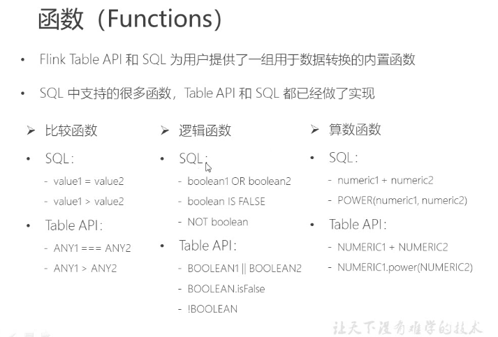


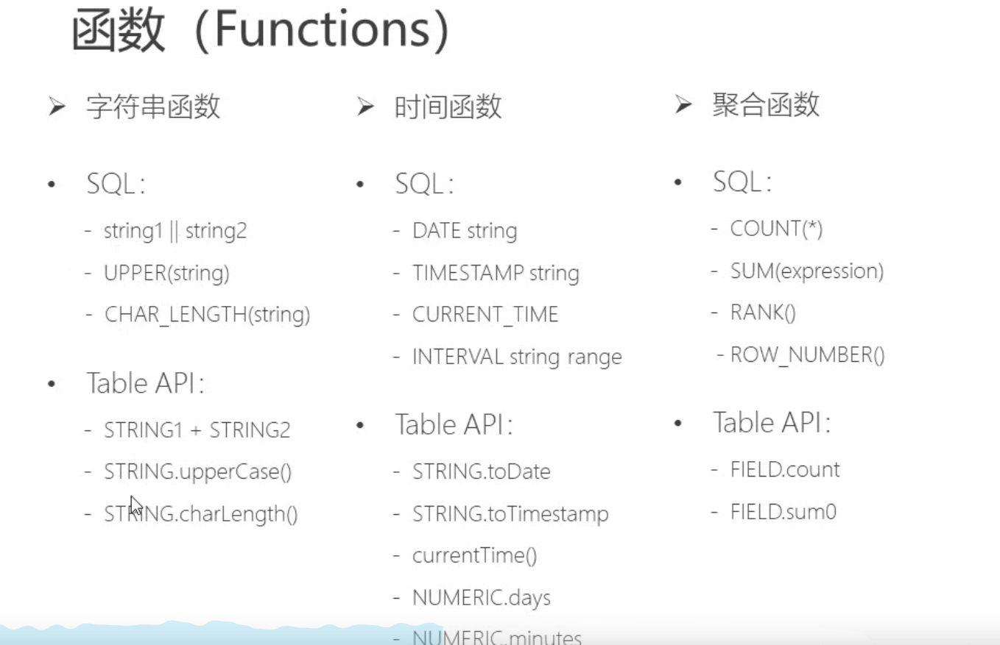


**UDF函数**

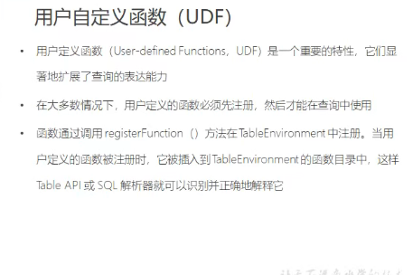


#### **标量函数**

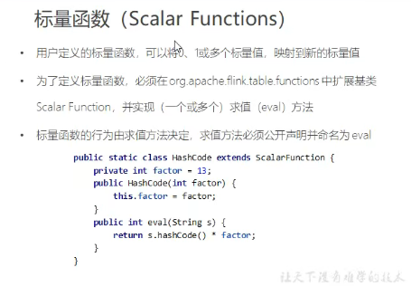


```java
//table API
HashCode hashCode = new HashCode("123");
//需要在环境中注册UDF
tableEnv.registerFunction("hashCode",hashCode);
//使用
//SQL
tableEnv.createTemporaryView("sensor",sensorTable);
Table resultSqlTable = tableEnv.sqlQurey("select id,ts,hashCode(id) from sensor");

//实现自定义的ScalarFunction
public static class HashCode extends ScalarFunction{
    private int factor = 13;
    //必须重写eval
    public int inval(String str){
        return str.hashCode()*factor;
    }
}
```

#### 表函数 （97节课）

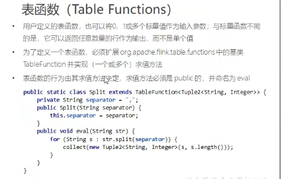


```java
//SQL
Table resultSqlTable = tableEnv.sqlQuery("select id,ts,word,length"+from sensor,lateral talbe(split(id)) as splitid(word,length))
```


#### 聚合函数（98节课）

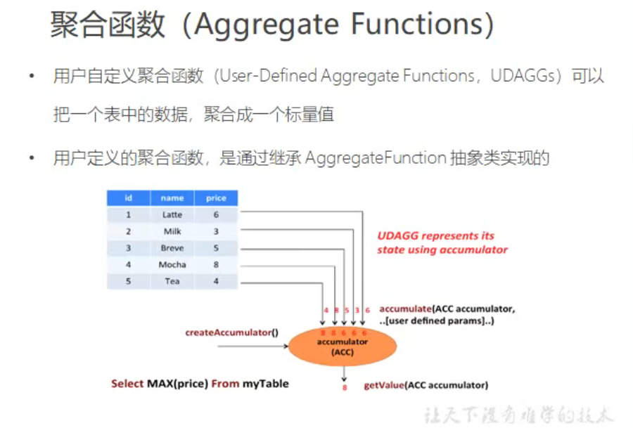


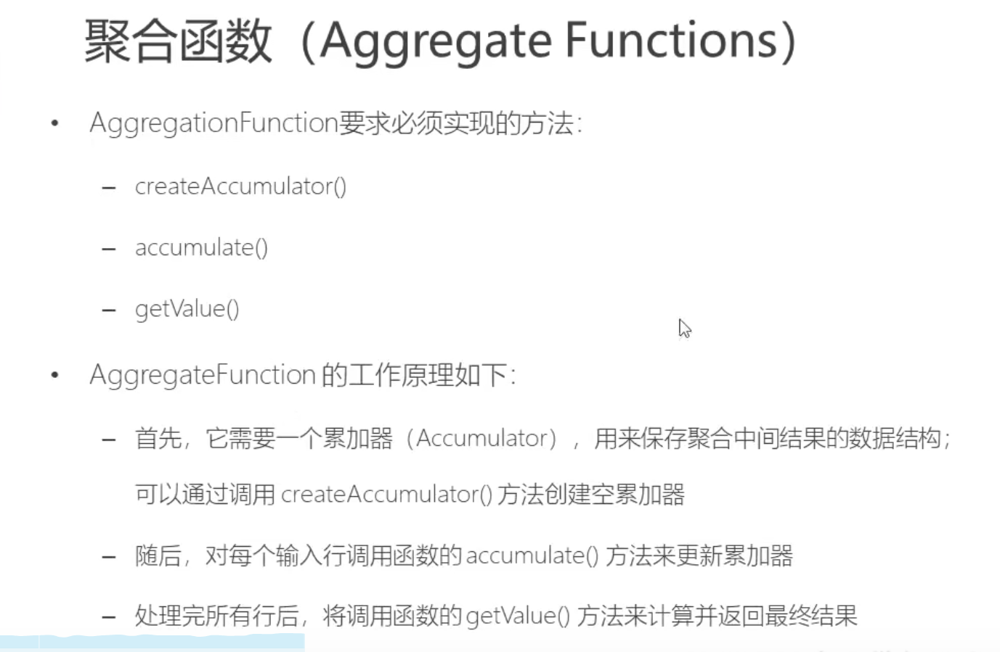


### 表聚合函数（99）

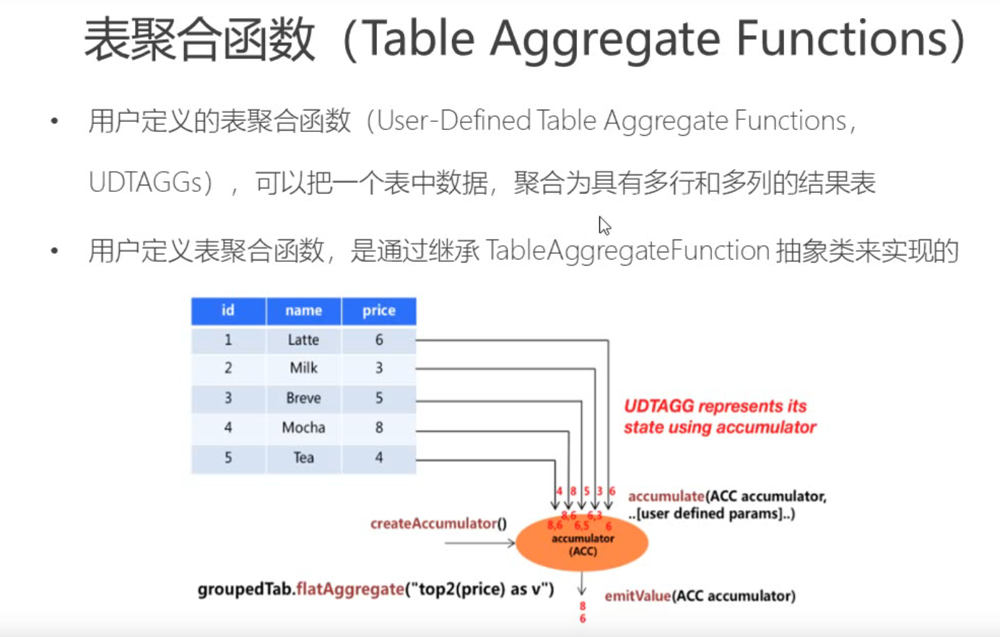


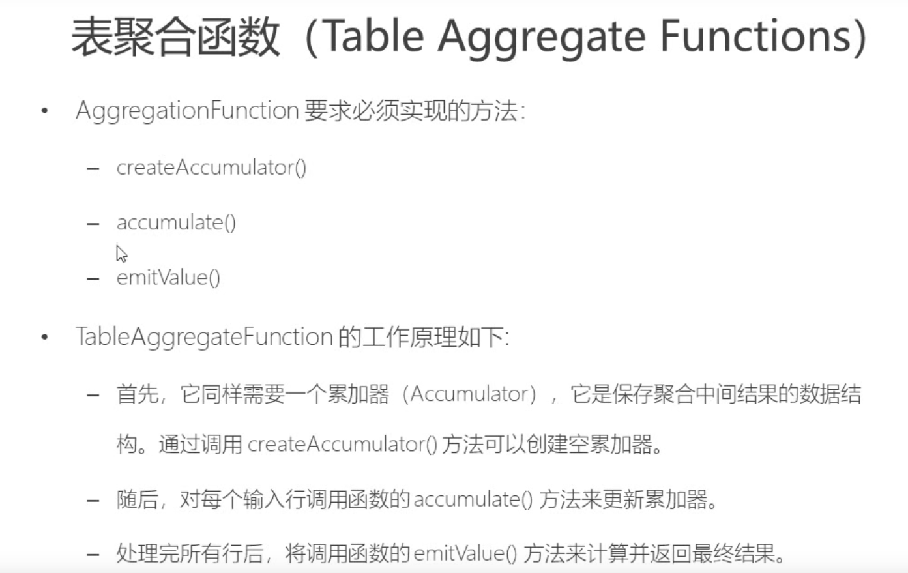
