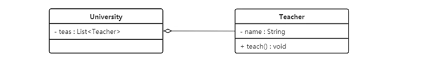
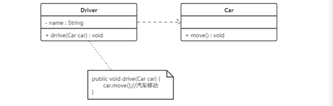
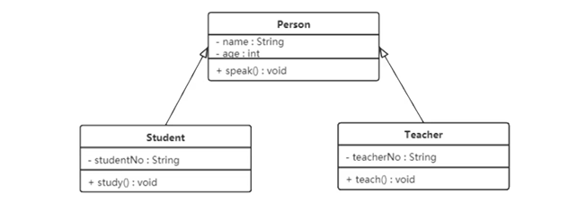
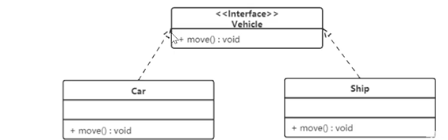

#  设计模式简述

## 软件设计模式

定义：软件设计模式，又称设计模式，是一套被反复使用、多数人知晓的、经过分类编目的、代码设计经验的总结。它描述了在软件设计过程中的一些不断重复发生的问题，以及该问题的解决方案。也就是说，它是解决特定问题的一系列讨论，是前辈们的代码设计经验的总结，具有一定的普遍性，可以反复使用。


### 设计模式分类 

创建型模式

解构型模式

行为型模式

## UML类图

统一建模语言（Unified Modeling Language,UML）是用来设计软件的可视化建模语言。它的特点是简单、统一、图形化、能表达软件设计中的动态和静态信息。

UML从目标系统的不同角度出发，定义了用例图、类图、对象图、状态图、活动图、时序图、协作图、构件图、部署图等9种图。

类图：类图是显示了模型的静态结构，特别是模型中存在的类、类的内部结构以及它们与其他类的关系等。类图不显示暂时性的信息。类图是面向对象建模的主要组成部分。


### 类图的表示方法

- +：表示public
- -：表示private
- #：表示protected

### 类图的关系表示方法

1. 单向关联（一个引用另外一个）

   


2. 双向关联

   

3. 自关联


4. 聚合关系
老师可以不依赖学校而单独存在。

   


5. 组合关系
嘴不可以脱离头而存在。


6. 依赖关系

   


7. 继承关系



8. 实现关系

   

## 软件设计原则

**开闭原则**：对扩展开放，对修改封闭。

**里氏代换原则**：任何基类可以出现的地方，子类一定可以出现。通俗理解：子类可以拓展父类的功能，但不能修改父类原有的功能。换句话说，子类继承父类时，除添加新的方法完成新增功能外，尽量不要重写父类的方法。

**依赖倒转原则**：高层模块不应该依赖低层模块，两者都应该依赖其抽象；抽象不应该依赖细节，细节应该依赖抽象。简单的说就是要求对抽象进行编程，不要对实现进行编程，这样就降低了客户与实现模块间的耦合。

**接口隔离原则**：客户端不应该被迫依赖于它不使用的方法；一个类对另一个类的依赖应该建立在最小的接口上。

**迪米特法则**：最少知识原则。如果两个软件实体无须直接通信，那么就不应当发生直接的相互调用，可以 通过第三方转发该调用。其目的是降低类之间的耦合度，提高模块的相对独立性。

**合成复用原则**：尽量先使用组合或者聚合等关联关系来实现，其次才考虑使用继承关系来实现。

# 结构型模式

## 享元模式

自我理解：用于资源管理，类似于数据库连接池，先建立资源库，后续需求进行资源申请。

**案例：Integer类，-128~127时会延用原对象。超出此数值时，会重新建对象 。**


# 行为型模式（11种）

行为型模式用于**描述程序在运行时复杂的流程控制**，即描述多个类或对象之间怎样相互协作共同完成单个对象都无法单独完成的任务，它涉及算法于对象间职责的分配。

行为型模式分为**类行为模式**和**对象行为模式**，前者采用继承机制来在类间分派行为，后者采用组合或聚合在对象间分配行为。由于组合关系或聚合关系必继承关系耦合度低，满足“合成复用原则”，所以对象行为模式比类行为模式具有更大的灵活性。

## 模板方法模式

定义：定义一个操作中的算法骨架，而将算法的一些步骤延迟到子类中，使得子类可以不改变该算法结构的情况下重定义该算法的某些特定步骤。

> **个人理解：**
>
> 父类中定义算法步骤，子类中负责实现算法步骤。一个巧妙的是父类是抽象类，定义算法通过算法步骤方法**（写死的）**，而具体实现步骤是**抽象方法**，由子类去实现。


举得例子说明：

> InputStream的案例

```java
public abstract int read() throws IOException; 

public int read(byte b[], int off, int len) throws IOException {
        if (b == null) {
            throw new NullPointerException();
        } else if (off < 0 || len < 0 || len > b.length - off) {
            throw new IndexOutOfBoundsException();
        } else if (len == 0) {
            return 0;
        }

        int c = read();  // 此方法调用了read的无参方法，而read的无参方法是抽象方法，需要子类实现。
        if (c == -1) {
            return -1;
        }
        b[off] = (byte)c;

        int i = 1;
        try {
            for (; i < len ; i++) {
                c = read();
                if (c == -1) {
                    break;
                }
                b[off + i] = (byte)c;
            }
        } catch (IOException ee) {
        }
        return i;
    }

```


## 策略模式

定义：该模式定义了一系列算法，并将每个算法封装起来，是他们可以相互替换，且算法的变化不会影响使用算法的客户。策略模式属于对象行为模式，它通过对算法进行封装，把使用算法的责任和算法的实现分割开来，并委派给不同的对象对这些算法进行管理。


> **自我理解：**
>
> 实现一种任务由多种方法。将方法作为策略，那么每种任务就有多种策略。

## 命令模式

定义：将一个请求封装为一个对象，使发出请求的责任和执行请求的责任分割开。这样两者之间通过命令对象进行沟通，这样方便将命令对象及逆行存储、传递、调用、增加和管理。


> **个人理解：**
>
> 服务员类调用厨师类中的方法，正常在服务员类中装有初始类的属性，进行调用。
>
> 命令者模式，在中间加一层，解耦服务员类和厨师类。

## 责任链模式

定义：又名职责链模式，为了避免请求发送者与多个请求处理者耦合在一起，将所有请求的处理者通过前一对象记住其下一个对象的引用而连成一条链；当有请求发生时，可将请求沿着这条链传递，直到有对象处理它为止。


> **个人理解**：
>
> 类似于请假链条，向主管请假，请多了，需要向经理请假，请多了需要向总经理请假.
>
> 实现javaweb的filter链条。实现如下功能：
>
> 前置信息A
> 前置信息B
> 后置信息B
> 后置信息A


## 状态模式

定义：对于有状态的对象，把复杂的“判断逻辑”提取到不同的状态对象中，允许状态对象在其内部状态发生改变时改变其行为。 


> 自我理解：
>
> 多个if else，将每个条件已经操作装进一个对象


## 观察者模式

定义：

又被成为发布-订阅模式（Publish/Subscribe）模式，它定义了一种一对多的依赖关系，让多个观察者对象同时监听某一个主题对象。这个主题对象在状态变化时，会通知所有的观察者对象，使他们能够自动更新自己。


> 个人理解：
>
> 主题更新后，观察者都能收到。
>
> 有意思的代码设计 ：在主题中装入List观者者，调用观察者的方法，以主题消息为参数。
>
> 注意：
>
> jdk有实现，为Observable（类） 和Observer（接口）


## 中介者模式

定义 ：又叫调停模式，定义一个中介角色来封装一系列对象之间的交互，使原有对象之间的耦合松散，且可以独立地改变他们之间的交互。


> 解耦双方关系，双方均通过中介者来实现解耦。


## 迭代器模式

定义：提供一个对象来顺序访问聚合对象中的一系列数据，而不暴露聚合对象的内部表示。


> 自我理解：
>
> 提供方便遍历的方法


## 访问者模式

定义：封装一些作用于某种数据结构中的各元素的操作，它可以不改变这个数据结构的前提下定义作用于这些元素的新的操作。


## 备忘录模式

定义：又叫快照模式，在不破坏封装性的前提下，捕获一个对象的内部状态，并在该对象之外保存这个状态，以便以后当需要时能将该对象恢复到原先保存的状态。


## 解释器模式

定义：给定一个语言，定义它的文法表示，并定义一个解释器，这个解释器使用该标识来解释语言中的句子。


> 个人理解：
>
> 解释语法树的一种方法。  类似于二叉树。

