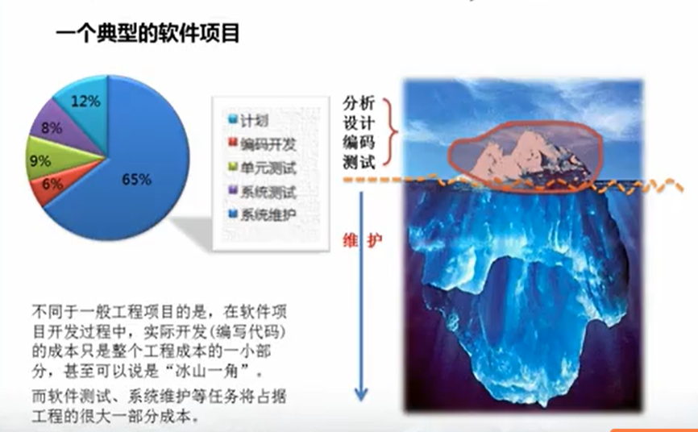
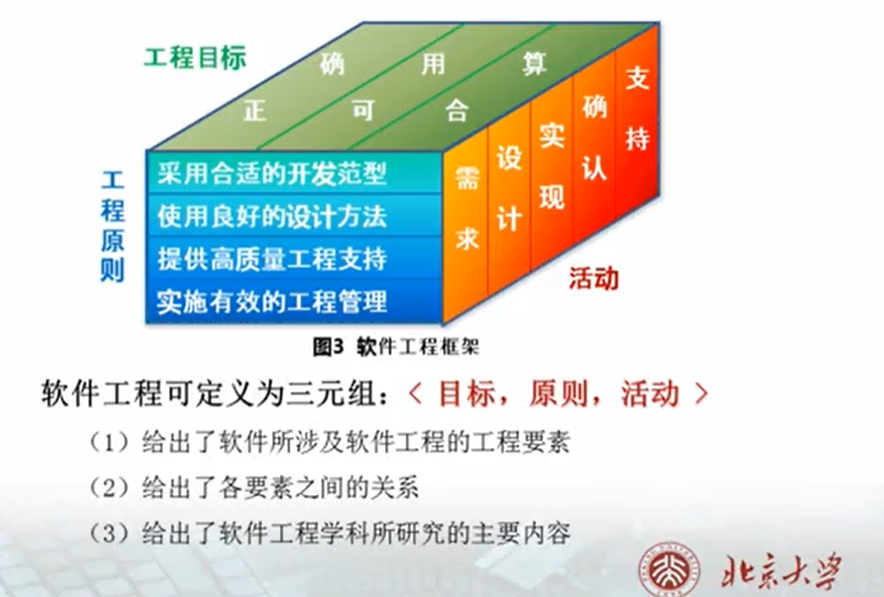
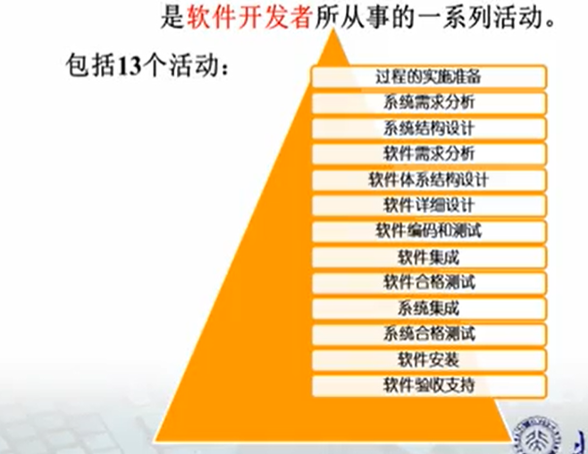
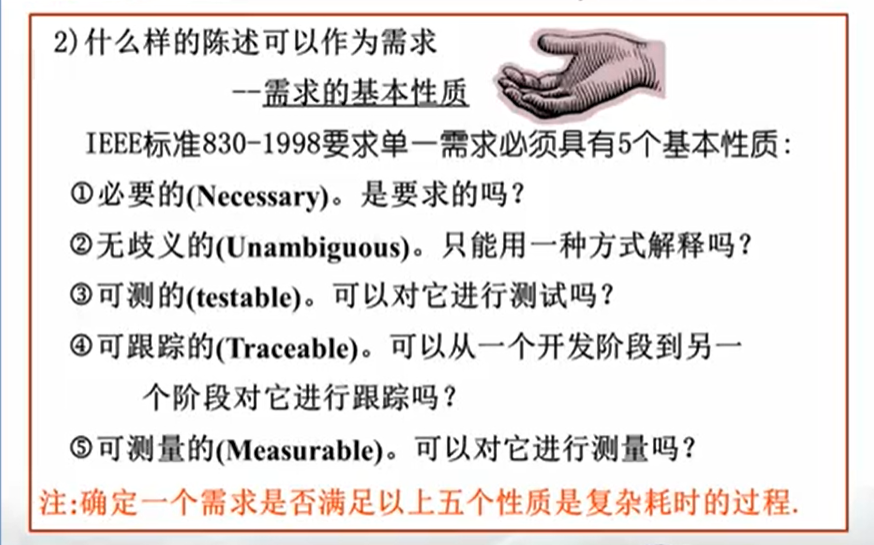
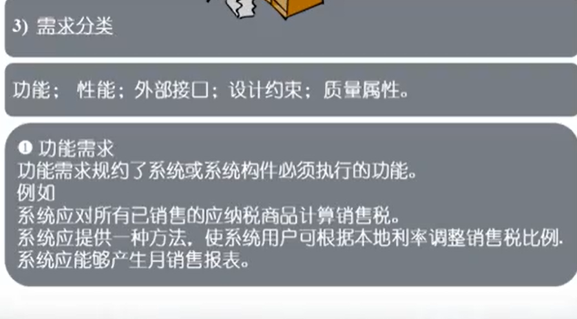

# 软件工程概论

## 软件的定义以及特点

### 软件的定义

软件由两部分组成，**程序**和**文档**

### 软件的特点

结论：设计以及实际开发在软件的整个生命成本中只占很少的一部分。

## 软件工程框架

### 软件开发过程

# 软件需求

## 需求的分类：

功能、性能、外部接口、设计约束、质量属性

## 需求内容应当包括优先级

## 软件需求规范中需要明确测试计划